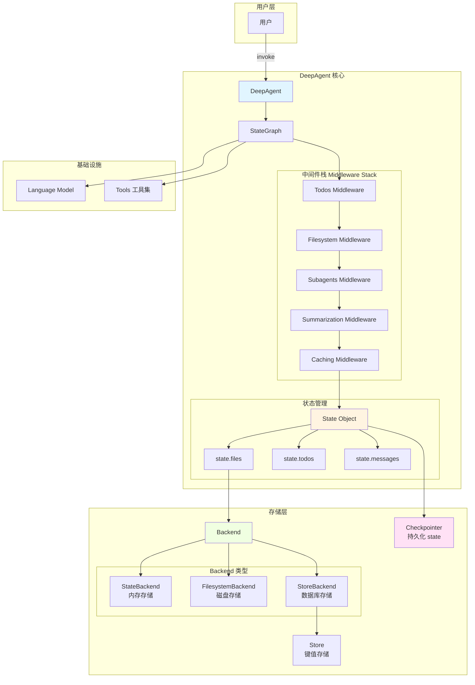
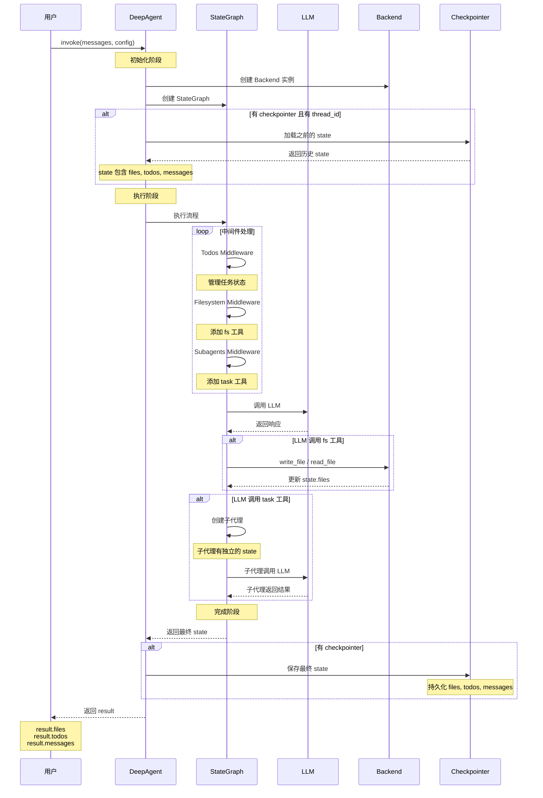
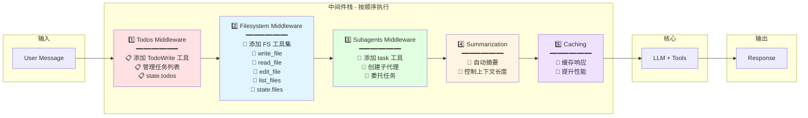
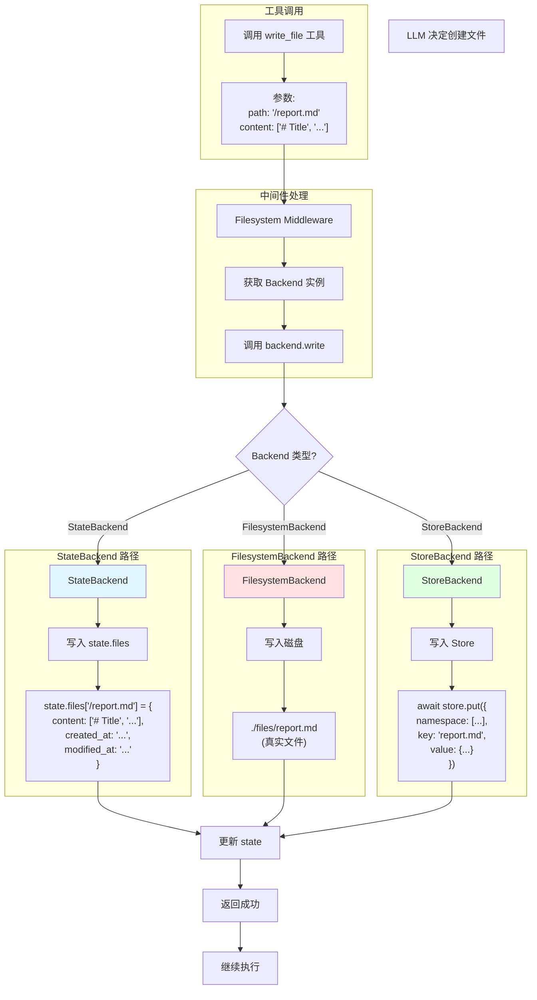
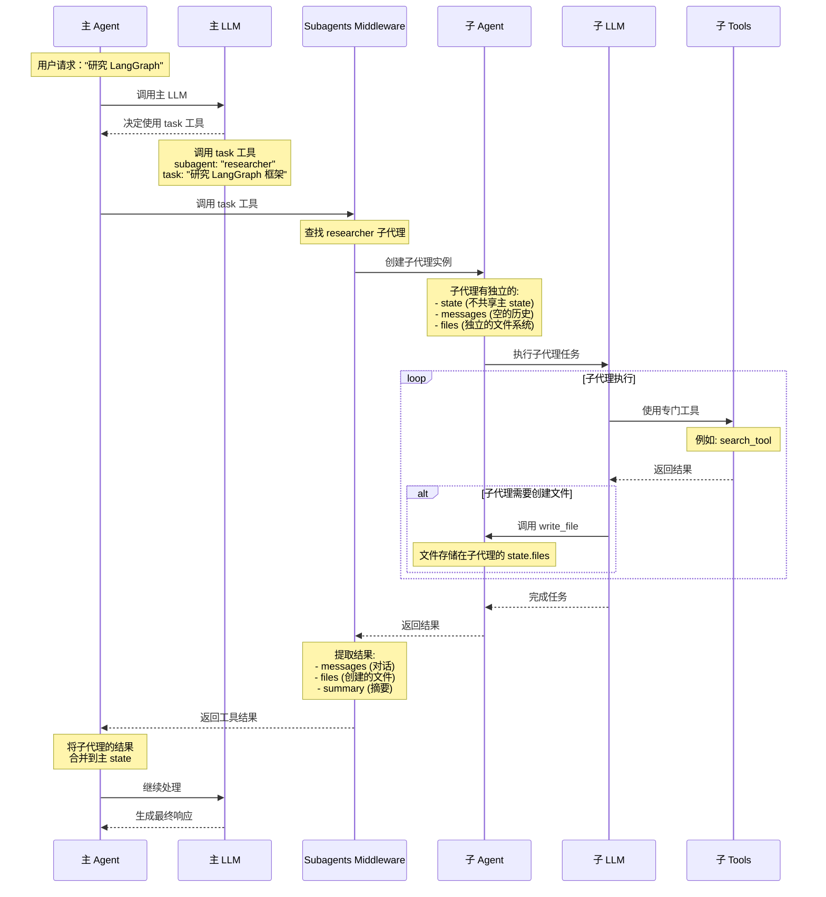
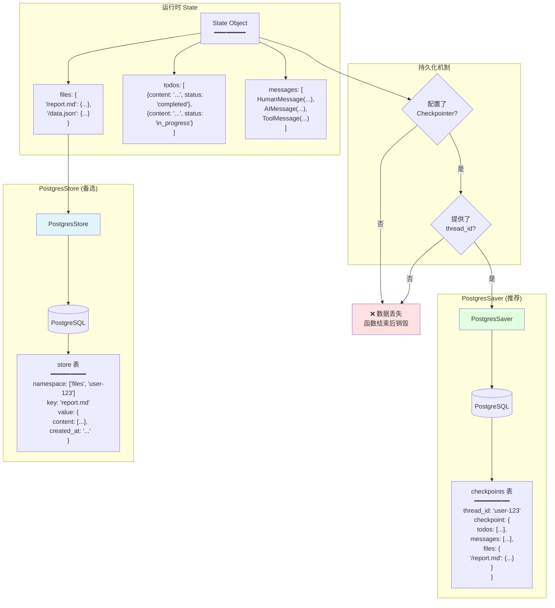
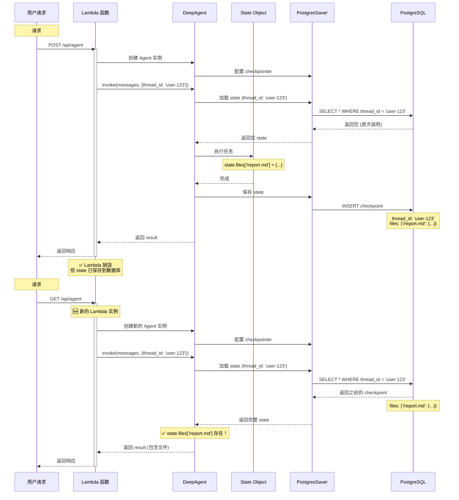
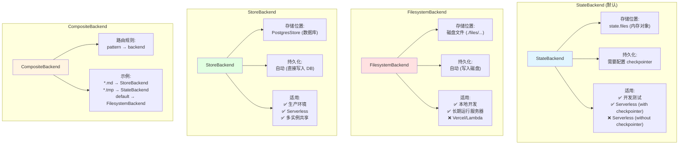
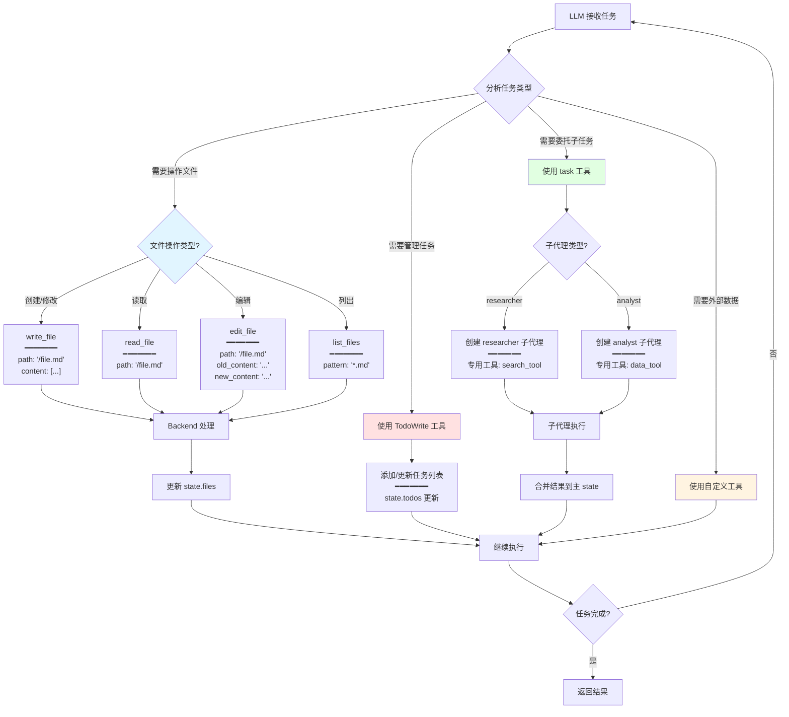
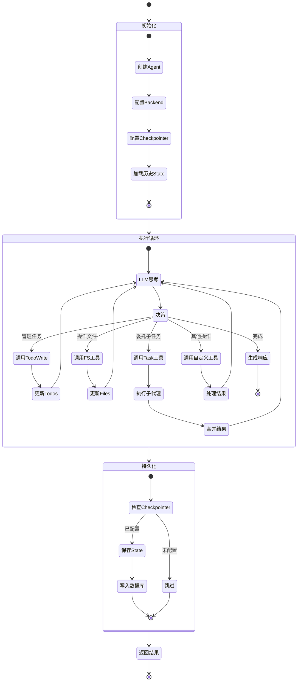

# DeepAgent 架构图解

这个文档使用 Mermaid 图表详细展示 DeepAgent 的运作方式。

---

## 1. 整体架构概览



---

## 2. 请求处理完整流程



---

## 3. 中间件栈详解



---

## 4. Filesystem Middleware 工作流程



---

## 5. Subagent 调用流程



---

## 6. State 持久化流程



---

## 7. Serverless 环境数据流



---

## 8. Backend 类型对比



---

## 9. 工具调用决策树



---

## 10. 完整请求生命周期



---

## 总结

这些图表展示了 DeepAgent 的核心运作机制：

1. **分层架构**：用户 → Agent → 中间件栈 → State → Backend
2. **中间件顺序**：Todos → Filesystem → Subagents → Summarization → Caching
3. **文件存储**：根据 Backend 类型，文件可以存储在内存、磁盘或数据库
4. **子代理隔离**：每个子代理有独立的 state 和上下文
5. **持久化关键**：在 serverless 环境必须配置 checkpointer + thread_id
6. **工具决策**：LLM 智能选择合适的工具来完成任务

核心理解：
```
DeepAgent = LLM + Middleware Stack + State Management + Backend Storage
```

每个组件都有明确的职责，通过 StateGraph 协调工作。
